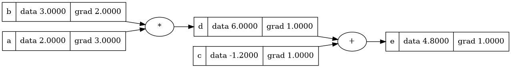

### Nanograd

A minimal implementation of automatic differentiation engine inspired by Andrej Karpathy's micrograd. This repository provides a simple neural network framework with automatic gradient computation for educational purposes.

### Features

- Automatic differentiation engine with Value objects
- Neural network implementation (MLP, Layer, Neuron)
- Support for basic operations: +, -, *, /, **, tanh, exp, relu
- Gradient computation via backpropagation
- Simple training loop for neural networks

### Usage

#### Basic Operations

```python
from nanograd.engine import Value
from utils.plot_exp import draw_dot

# Create Value objects
a = Value(2.0, label='a')
b = Value(3.0, label='b')
c = Value(-1.2, label='c')

# Perform operations
d = a * b
d.label = 'd'
e = d + c
e.label = 'e'
e.backward()

# Compute gradients
c.backward()

# plot the computation graph
draw_dot(c)
```



#### Neural Networks

```python
from nanograd.nn import MLP

# Create a multi-layer perceptron
model = MLP(3, [4, 4, 1])  # 3 inputs, hidden layers of 4,4,1

# Training data
xs = [[2.0, 3.0, -1.0], [3.0, -1.0, 0.5], [0.5, 1.0, 1.0], [1.0, 1.0, -1.0]]
ys = [1.0, -1.0, -1.0, 1.0]

# Train the model
model.train(xs, ys, n_iter=100, lr=0.01)

# Make predictions
prediction = model([Value(xi) for xi in xs[0]])
print(f"Prediction: {prediction.data}")
```

### Running Tests

To run the test suite:

```bash

PYTHONPATH=. python3 -m unittest test.test_nano

# for specific test
PYTHONPATH=. python3 -m unittest test.test_nano.TestValue.test_add

# with verbose output
PYTHONPATH=. python3 -m unittest test.test_nano -v
```

### Project Structure

```
nanograd/
├── engine.py    # Core Value class and operations
├── nn.py        # Neural network components
├── __init__.py

test/
├── test_nano.py 
├── __init__.py
```
#### Experiments and piecewise demo 
refer to file `experiments-grad.ipynb`

### Requirements

- Python 3.6+
- graphviz (only if you want to plot the computation graph)

### References

- [Micrograd](https://github.com/karpathy/micrograd)
- [Neural Networks from Scratch](https://www.youtube.com/watch?v=VMj-3S1tku0)